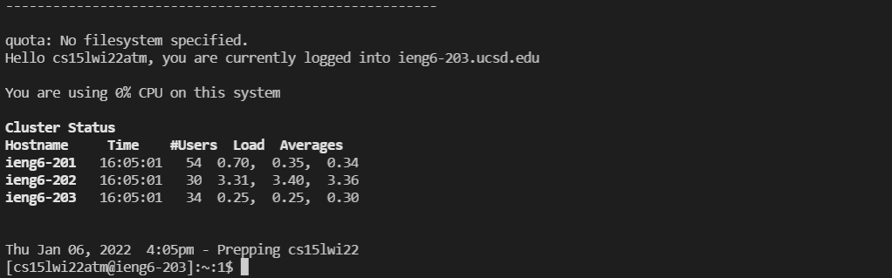
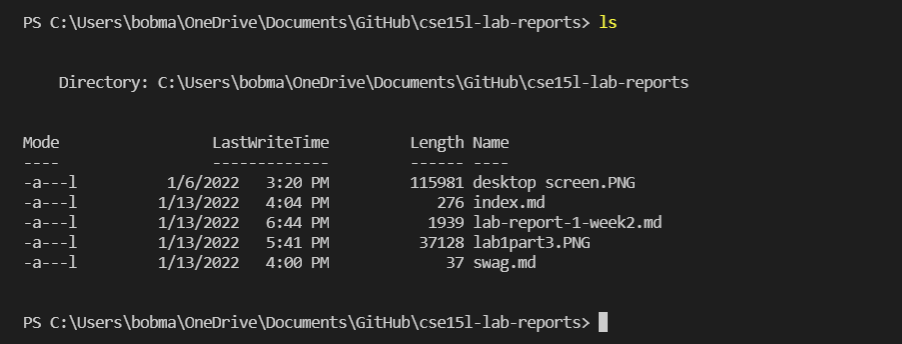

## Lab Report 1: Setting up Remote Access
# Overview
Hello! Welcome to CSE 15L! In this lab report, I will walk through the basic steps that are required to set up remote access.

The topics covered will be the following:
1. Installing VS Code
2. Remotely Connecting
3. Trying some commands
4. Moving files with `scp`
5. Setting an SSH key
6. Optimizing Remote running

If any problems arise, feel free to go to office hours to have any questions answered.
# Installing VS Code
* The first step is to install VS code if you haven't already. If you have taking a class with Joe before, you very likely already have VS Code installed
* You can download VS Code [here.](https://code.visualstudio.com/download) Pick the right version for your computer.

* VS Code is an IDE that we will use for this class. The home screen should look something like the image below.

# Remotely Connecting
 Once you have set your IDE up, you can start remotely connecting. There is a couple of steps to follow, which are listed here.
1. Install OpenSSH on your system by following the steps [here.](https://docs.microsoft.com/en-us/windows-server/administration/openssh/openssh_install_firstuse) 
2. Next, you lookup your account information [here.](https://sdacs.ucsd.edu/~icc/index.php)
3. We now do the command `$ ssh cs15lwi22zz@ieng6.ucsd.edu`, replacing `zz` with your own initials found in step 2 in the VS code terminal.
4. Agree to the prompts shown, and after that your terminal will display a message similar to the picture below.

# Trying some commands
Now that we are connected, we can try running some commands. Here is a list of commands and what they do.
* `cd`: used for changing directory

* `cd~`: used to go to the home directory

* `ls`: lists the files in the current directory

In the image below, you can see the ls command being used on my machine, which lists the files in the directory i am working on.

# Moving Files with SCP.

