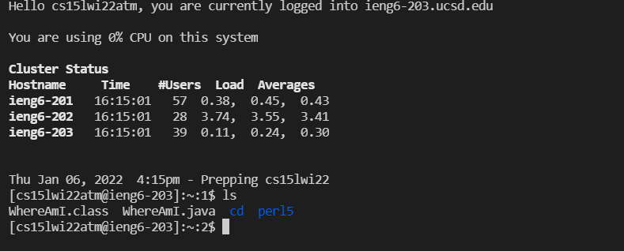
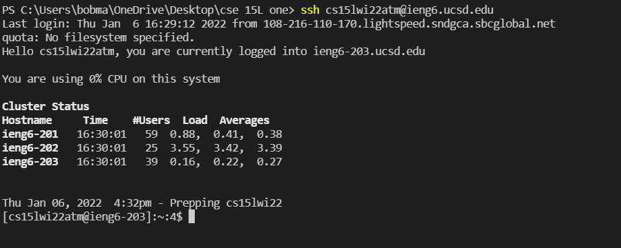
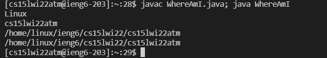
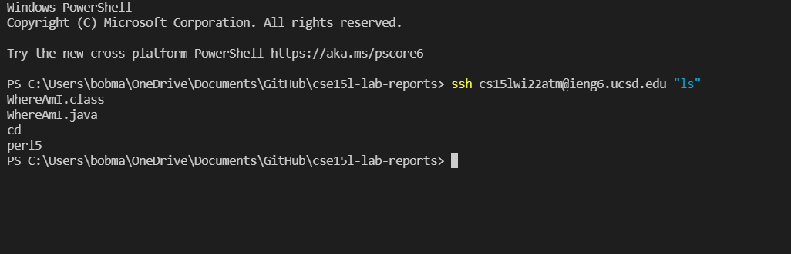

>## Lab Report 1: Setting up Remote Access
># Overview
Hello! Welcome to CSE 15L! In this lab report, I will walk through the basic steps that are required to set up remote access.

The topics covered will be the following:
1. Installing VS Code
2. Remotely Connecting
3. Trying some commands
4. Moving files with `scp`
5. Setting an SSH key
6. Optimizing Remote running

If any problems arise, feel free to go to office hours to have any questions answered.
># Installing VS Code
* The first step is to install VS code if you haven't already. If you have taking a class with Joe before, you very likely already have VS Code installed
* You can download VS Code [here.](https://code.visualstudio.com/download) Pick the right version for your computer.

* VS Code is an IDE that we will use for this class. The home screen should look something like the image below.


># Remotely Connecting
 Once you have set your IDE up, you can start remotely connecting. There is a couple of steps to follow, which are listed here.
1. Install OpenSSH on your system by following the steps [here.](https://docs.microsoft.com/en-us/windows-server/administration/openssh/openssh_install_firstuse) 
2. Next, you lookup your account information [here.](https://sdacs.ucsd.edu/~icc/index.php)
3. We now do the command `$ ssh cs15lwi22zz@ieng6.ucsd.edu`, replacing `zz` with your own initials found in step 2 in the VS code terminal.
4. Agree to the prompts shown, and after that your terminal will display a message similar to the picture below.


># Trying some commands
Now that we are connected, we can try running some commands. Here is a list of commands and what they do.
* `cd`: used for changing directory

* `cd~`: used to go to the home directory

* `ls`: lists the files in the current directory

In the image below, you can see the ls command being used on my machine, which lists the files in the directory i am working on.


># Moving Files with SCP.
A command that will come in handy for copying files from your computer to the remote server you have connected is `scp`.

* In order to copy something from your machine to the server, do the command ` $ scp filename.java cs15lwi22(your initials)@ieng6.ucsd.edu: ` on your VS code terminal.

* In order to see if the transfer was succesful, you can do the command `ls` when connected to the server, and check if the file you added with the `scp` command. Below is a screenshot of the commands working.



> # Setting an SSH key.

Setting up an SSH key makes login in and out of a server easier, as it bypasses the need to type your password whenever you log in, add files, etc.

* The key command is `ssh-keygen`, which creates both a private and public key. The private key goes to your computer, the private key goes to the server.

> Here is how to go about generating your SSH key.

```
# on your device:
$ ssh-keygen
Generating public/private rsa key pair.
Enter file in which to save the key (/Users/joe/.ssh/id_rsa): /Users/joe/.ssh/id_rsa
Enter passphrase (empty for no passphrase): 
Enter same passphrase again: 
Your identification has been saved in /Users/joe/.ssh/id_rsa.
Your public key has been saved in /Users/joe/.ssh/id_rsa.pub.
The key fingerprint is:
SHA256:jZaZH6fI8E2I1D35hnvGeBePQ4ELOf2Ge+G0XknoXp0 joe@Joes-Mac-mini.local
The key's randomart image is:
+---[RSA 3072]----+
|                 |
|       . . + .   |
|      . . B o .  |
|     . . B * +.. |
|      o S = *.B. |
|       = = O.*.*+|
|        + * *.BE+|
|           +.+.o |
|             ..  |
+----[SHA256]-----+
```

* This has created two files that are stored in your `.ssh` directory on your computer.
    1. The private key, `id_rsa`
    2. The public key, `id_rsa.pub`

* We now want to copy the **public key, NOT the private one** to our user in the server. Below is how you should do this
```
$ ssh cs15lwi22zz@ieng6.ucsd.edu
<Enter Password>
# now on server
$ mkdir .ssh
$ <logout>
# back on client
$ scp /Users/joe/.ssh/id_rsa.pub cs15lwi22@ieng6.ucsd.edu:~/.ssh/authorized_keys
# You use your username and the path you saw in the command above
```
* After doing this, you should be able to use the commands `ssh` and `scp` without using your password, shown in the image below.



># Optimizing Remote Running
* Pictured here are some commands I found interesting, as they make running programs or transfering files easier. The first handy trick is that you can run several commands at once if you separate them with a `;` separating the statements, as pictured below.



* You can also run a command with quotes at the end of the `ssh` statement to run the command on the server and immediatly log out.



># Wrap Up

And with that, you are done! You can now transfer files to the server if you followed the instructions correctly.