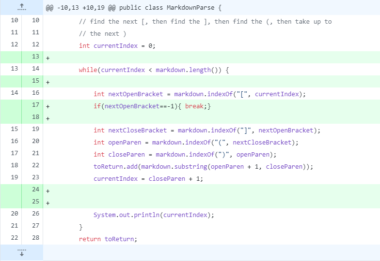
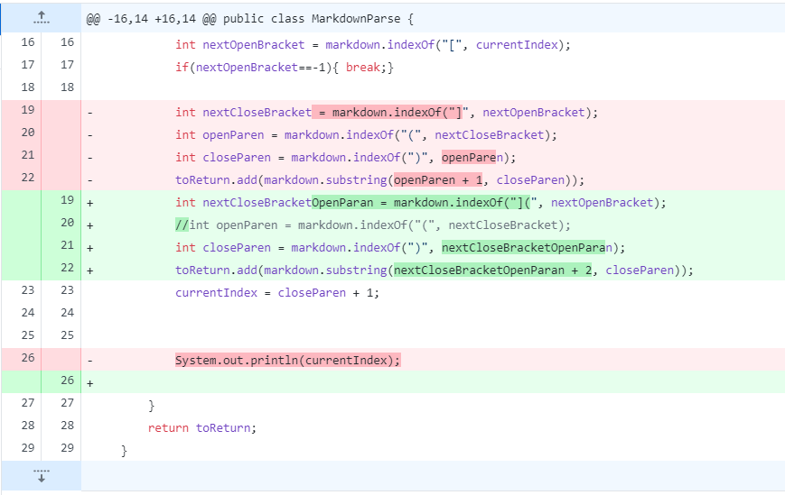
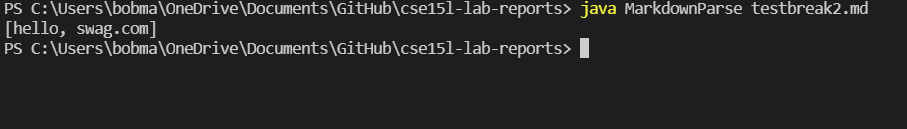
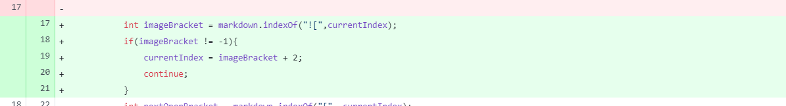
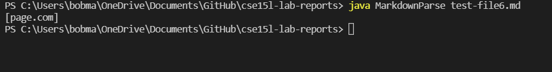

# Lab Report 2: Debugging

A fundamental aspect of developing software is making sure that the behavior of our code is consistent with what we defined it to be as "normal" In the following report, I will talk about some changes we made in the provided MarkdownParse.java file we recieved in order to ensure proper behavior

# First Issue
## First code change:

## Failure-inducing Input
[test1.md](test1.md)

## Symptom of bug

## Bug-Symtpom-Failure-inducing input relationship

The bug that was shown in the picture above was an infinite loop. We Initially ofund this because we noticed that we were recieving no output when running `java MarkdownParse test1.md`. We decided to add a print statement to find out what was going on, and we noticed an infinite loop which made us realize we needed to add a break statement in case the next open bracket wasn't found in order to avoid the infinite repeating loop.

# Second Issue
## Second code change

## Failure-inducing Input
[testbreak2.md](testbreak2.md)
## Symptom of bug

## Bug-Symtpom-Failure-inducing input relationship

The bug we found here was unexpected, as we had written an array in one line and a paranthesis in another. We did not expect the content in the parenthesis to be included with the output. In order to fix this, we added an aditional constraint that in order for text to be considered a link, the closing bracked must be adjacent to the opening paranthesis.

# Third Issue
## Second code change

## Failure-inducing Input
[test-file6.md](test-file6.md)
## Symptom of bug

## Bug-Symtpom-Failure-inducing input relationship

This bug sparked some discussion in our group, as we were unsure if this should technically be a link, but we came to the conclusion it shouldn't due to the syntaxes being different. We added more constraints to MarkdownParse.java in order to avoid this type of bug where images are wrongly identified as links. We added a `continue` statement in order to fix this bug.

# Final Thoughts

This week's lab was very helpful, as I learned how to actually test programs that I develop and not just copy the sample problems that we are given in PA's or rubrics. We have to think outside the box, and make sure we put our programs through different type of tests.