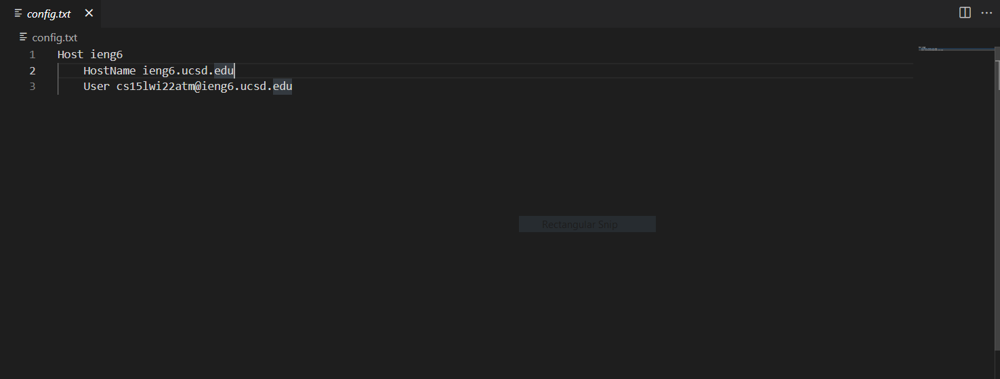
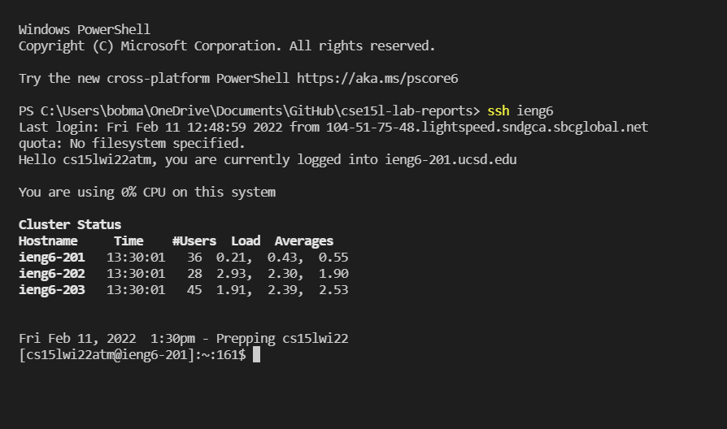
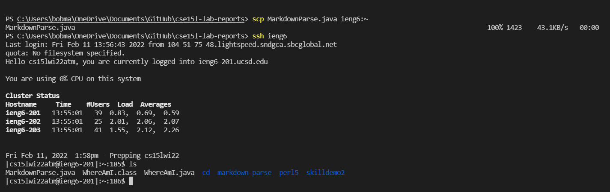

# Lab Report 3: Making ssh even more convenient

[Index](https://cfg00.github.io/cse15l-lab-reports/index.html)

# Streamlining ssh Configuration
## .ssh/config 

This is the file that we created in order to be able to log in to ssh much easier. I used Visual Studio Code to make and edit the file. The host is the ieng6.ucsd.edu server, and the user is my class account.

## using the ssh command to log in.

Now that we set up an even easier way to log in, it is easier to access the remote server as we don't have to type in our account name. We simply do `ssh <host name>`
in order to log in. Attached is a screen shot of me logging in in this way.

## using scp to transfer files

Now we can transfer files in a more efficient way, as we don't need to type in so many keys in order to use `scp` to transfer files to the remote server. The command is `scp <file name> <host-name>:~`

## Conclusion

And with that, the ssh configuration is done! Now it is easier to use, and much faster to transfer files.