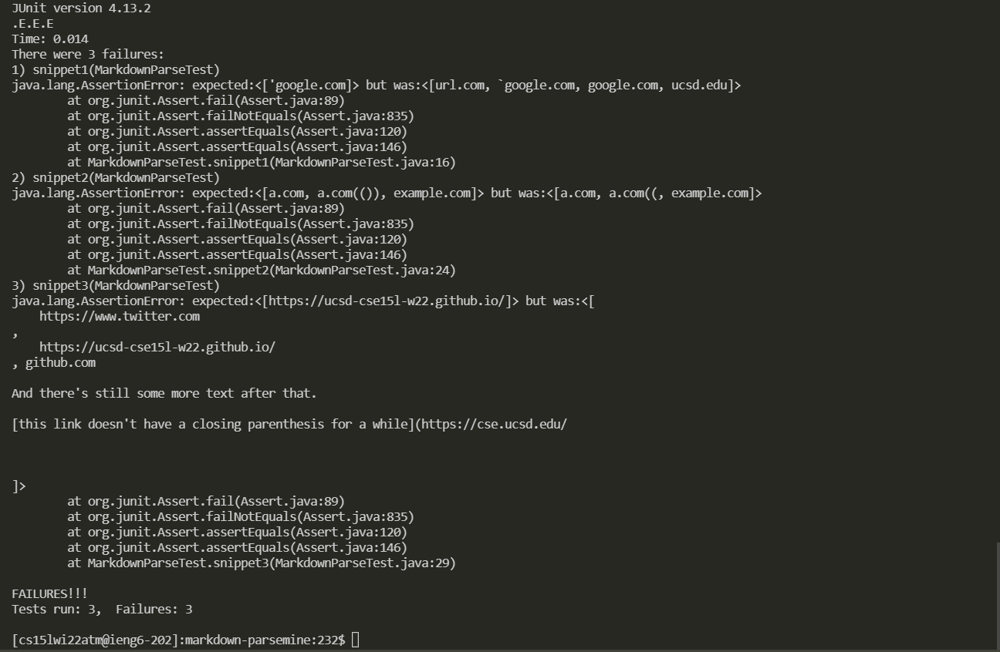

# Lab Report 4: Debuggers

## What should we be seeing?

Based on [the website provided](https://spec.commonmark.org/dingus/), the output should be as follows

Snippet 1: ["'google.com"]

Snippet 2: ["a.com", "a.com(())", "example.com"]

Snippet 3: ["https://ucsd-cse15l-w22.github.io/"]

## What is the implementation for the tester?

For both implementations, the tester looks like this:

```
public class MarkdownParseTest {
    @Test
    public void snippet1() throws IOException{
        assertEquals(List.of("'google.com"), MarkdownParse.getLinks(Files.readString(Path.of("snippet1.md"))));
    }

    @Test
    public void snippet2() throws IOException{

        assertEquals(List.of("a.com", "a.com(())", "example.com"), MarkdownParse.getLinks(Files.readString(Path.of("snippet2.md"))));
    }

    @Test
    public void snippet3() throws IOException{
        assertEquals(List.of("https://ucsd-cse15l-w22.github.io/"), MarkdownParse.getLinks(Files.readString(Path.of("snippet3.md"))));
    }
}
```
## Testing my implementation

While testing my implementation, all three tests failed. Attached is the JUnit tester and the feedback in the image attached below


## Testing my peer's implementation

While testing my peer's implementation, the tests also resulted in a failure for all three files. Attached is the JUnites tester and the feedback from these tests.


## Snippet 1 reflection
For snippet 1, I do believe that there might be a small code change that is less than 10 lines in order to fix this error. This error is similar to an error we fixed previously in lab, as our program confused images with links and we fixed this with few lines of code (about 3 lines). This leads me to believe that this error may be a bug that can be resolved in a few lines.

## Snippet 2 reflection
For snippet 2, I also believe that the error may be resolved in a few lines as well. I say this because it is also a similar problem we had faced previously, except that in this case the program is not giving the expected values because of double parenthesis. We fixed this with brackets in a few lines, so the paranthesis case shouldn't be too different.
## Snippet 3 reflection
For snippet 3, I don't think that this bug may be fixed in less than 10 lines. The issue here is that my implementation gives a very long output, which is very different than any case we had previously seen. A way to address this issue would be to check for line breaks in order to cut the output shorter.
