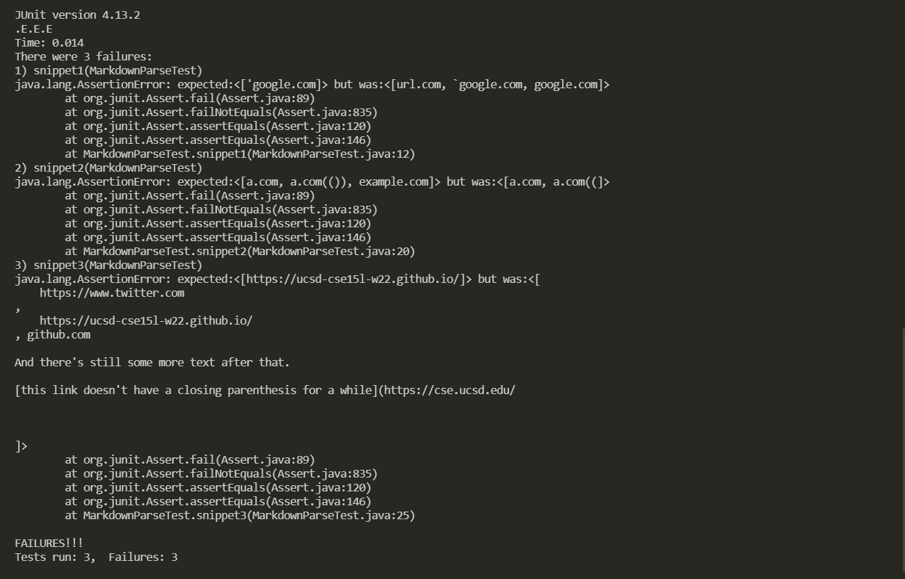

# Lab Report 4: Debuggers

## What should we be seeing?

Based on [the website provided](https://spec.commonmark.org/dingus/), the output should be as follows

Snippet 1: ["'google.com"]

Snippet 2: ["a.com", "a.com(())", "example.com"]

Snippet 3: ["https://ucsd-cse15l-w22.github.io/"]

## What is the implementation for the tester?

For both implementations, the tester looks like this:

```
public class MarkdownParseTest {
    @Test
    public void snippet1() throws IOException{
        assertEquals(List.of("'google.com"), MarkdownParse.getLinks(Files.readString(Path.of("snippet1.md"))));
    }

    @Test
    public void snippet2() throws IOException{

        assertEquals(List.of("a.com", "a.com(())", "example.com"), MarkdownParse.getLinks(Files.readString(Path.of("snippet2.md"))));
    }

    @Test
    public void snippet3() throws IOException{
        assertEquals(List.of("https://ucsd-cse15l-w22.github.io/"), MarkdownParse.getLinks(Files.readString(Path.of("snippet3.md"))));
    }
}
```
## Testing my implementation

While testing my implementation, all three tests failed. Attached is the JUnit tester and the feedback in the image attached below


## Testing my peer's implementation

While testing my peer's implementation, the tests also resulted in a failure for all three files. Attached is the JUnites tester and the feedback from these tests.



